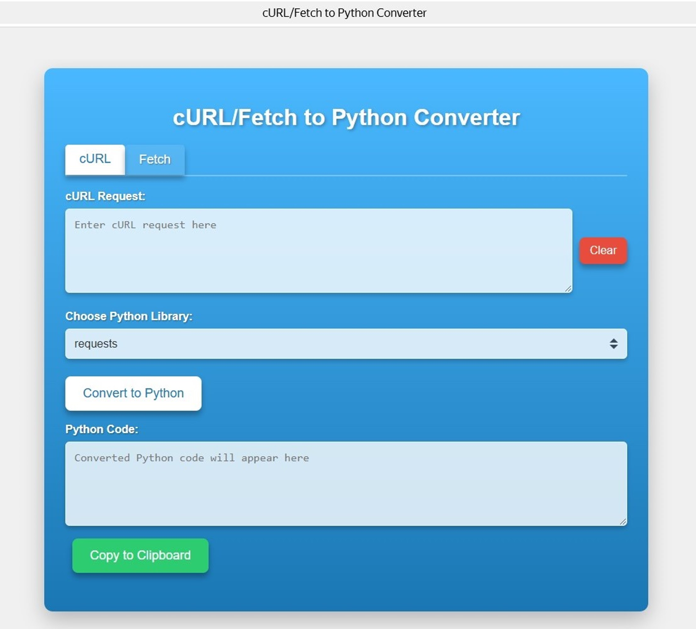

# Приложение-конвертер на базе фреймворка Fast-API


## Установка проекта
Проект нужно скачать из открытого репозитория:

```
https://github.com/AIlyin-droid/Diploma_GB.git
```

Перейдите в папку проекта и запустите контейнер следующей командой:

```
sudo docker-compose up app
```

В командной строке будет отображено, что приложение развернуто и им можно пользоваться, подключаясь к localhost:

```
http://0.0.0.0:8000
```

P.S. Просмотр документации проетка доступен по следующей ссылке:

```
http://0.0.0.0:8000/docs
```
